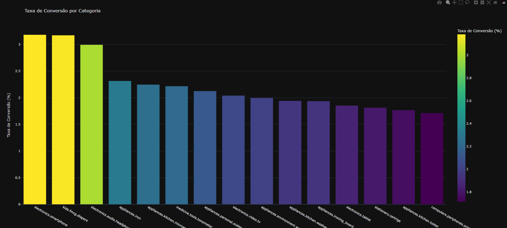

# Projeto 3: Análise de Comportamento de Usuários (E-commerce) 🧾📈

Fala pessoal! Esse aqui é o meu terceiro projeto focado em análise de dados. 

O objetivo principal aqui foi entender o **comportamento dos usuários** dentro de um e-commerce gigante. Usei um dataset real com milhões de eventos para descobrir onde as pessoas mais desistem de comprar e quais categorias convertem melhor.



### 🧠 O que eu usei e aprendi:
*   **SQL (Direct Query):** Usei o DuckDB para rodar queries SQL direto em arquivos CSV gigantes (5GB+) sem precisar subir um banco de dados inteiro. Foi animal ver a velocidade disso.
*   **Funil de Conversão:** Analisei o caminho completo: *Visualizou -> Adicionou ao Carrinho -> Comprou*. 
*   **Python + Plotly:** Criei gráficos interativos para visualizar os gargalos e a receita por marca.
*   **Data Cleaning:** Lidei com anomalias reais, como compras que acontecem sem o evento de 'cart' ser registrado.

### 📊 Onde baixar os dados?
Para rodar esse projeto com os dados reais, você precisa baixar o dataset oficial no Kaggle:
👉 [Download do Dataset no Kaggle](https://www.kaggle.com/datasets/mkechinov/ecommerce-behavior-data-from-multi-category-store?resource=download)

*(Recomendo o arquivo `2019-Oct.csv` para começar)*.

### 🚀 Como rodar na sua máquina:

1.  **Clone o repositório:**
    ```bash
    git clone https://github.com/IgorCoding123/Projeto3_AnaliseDeDados.git
    cd Projeto3_AnaliseDeDados
    ```

2.  **Instale as dependências:**
    ```bash
    pip install -r requirements.txt
    ```

3.  **Prepare os dados:**
    *   Crie uma pasta chamada `archive/` na raiz do projeto.
    *   Coloque o arquivo `.csv` que você baixou do Kaggle dentro dessa pasta.

4.  **Execute a análise:**
    ```bash
    python src/main_analysis.py
    ```

O script vai processar os milhões de dados e gerar arquivos `.html` interativos (como o `funil_conversao.html`) para você abrir no seu navegador!

---
Bora pra cima! 🚀
